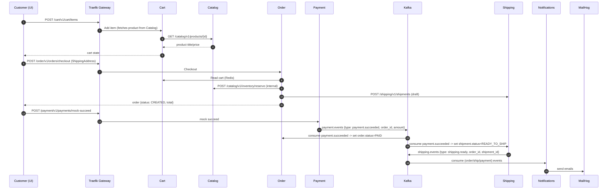

# Architecture Overview

This project is a *Python-only* microservices stack for a simple e-commerce flow. It’s designed for local development with Docker, but the services are cleanly separated and can run independently.

## Services at a glance

* **Auth** — user registration/login, JWT issuance.
* **Catalog** — categories, products, product images (S3/MinIO), inventory (stock/reserved).
* **Cart** — per-user cart stored in Redis; snapshots price/title at add-time.
* **Order** — turns a cart into an order; reserves inventory; emits `order.created`.
* **Payment** — mock payment provider; emits `payment.succeeded` (and optionally failures).
* **Shipping** — manages shipment lifecycle; creates draft at checkout; becomes `READY_TO_SHIP` after payment event; supports dispatch; emits shipping events.
* **Notifications** — consumes events and sends emails (via MailHog in local env).

## Infra

* **Postgres**: single DB instance shared by services, each with its own Alembic version table and tables.
* **Redis**: cart store.
* **Kafka + Zookeeper**: async event backbone.
* **MinIO (S3-compatible)**: product media storage.
* **Traefik**: edge/gateway (path-based routing).
* **MailHog**: local SMTP sink + UI ([http://localhost:8025](http://localhost:8025)).

## Authentication & internal auth

* End-user APIs use **JWT** Bearer tokens (issued by Auth).
* Internal/back-channel APIs (like `inventory/reserve` and `restock`) require the `X-Internal-Key` header **and** (where applicable) admin authorization.

## Databases & Migrations

* Each service owns its tables but shares the same Postgres instance.
* Alembic migrations live under each service’s `alembic/` directory.
* Use `scripts/seed.py` to run `alembic upgrade head` for all services.

## Event flows (happy path)

## Order & Shipping state machines

**Order**

* `CREATED` → (on `payment.succeeded`) → `PAID`
* (Optional future: `CANCELLED`, `REFUNDED`)

**Shipment**

* `PENDING_PAYMENT` → (on `payment.succeeded`) → `READY_TO_SHIP` → (via dispatch API) → `DISPATCHED` → (future) `DELIVERED` / `CANCELLED`

## Topics & Keys

* `order.events` — produced by Order (e.g., `order.created`).
* `payment.events` — produced by Payment (e.g., `payment.succeeded`).
* `shipping.events` — produced by Shipping (e.g., `shipping.ready`, `shipping.dispatched`).

**Partition key**: `order_id` (string).
**Idempotency**: Consumers should upsert by `order_id`/`shipment_id` and treat events as at-least-once delivered.

## Networking

Traefik routes path prefixes to services:

* `/auth`, `/catalog`, `/cart`, `/order`, `/payment`, `/shipping`, `/notifications`

Direct container access is on port `8000` for each service; via gateway use the prefixed paths above.

## Local dev scripts

* `scripts/setup.py` — venv + dev deps & helpers.
* `scripts/rebuild.py` — clean rebuild via docker compose/bake.
* `scripts/seed.py` — run all Alembic migrations.
* `scripts/run_demo.ps1` — end-to-end flow (works on PowerShell 5/7).

---
